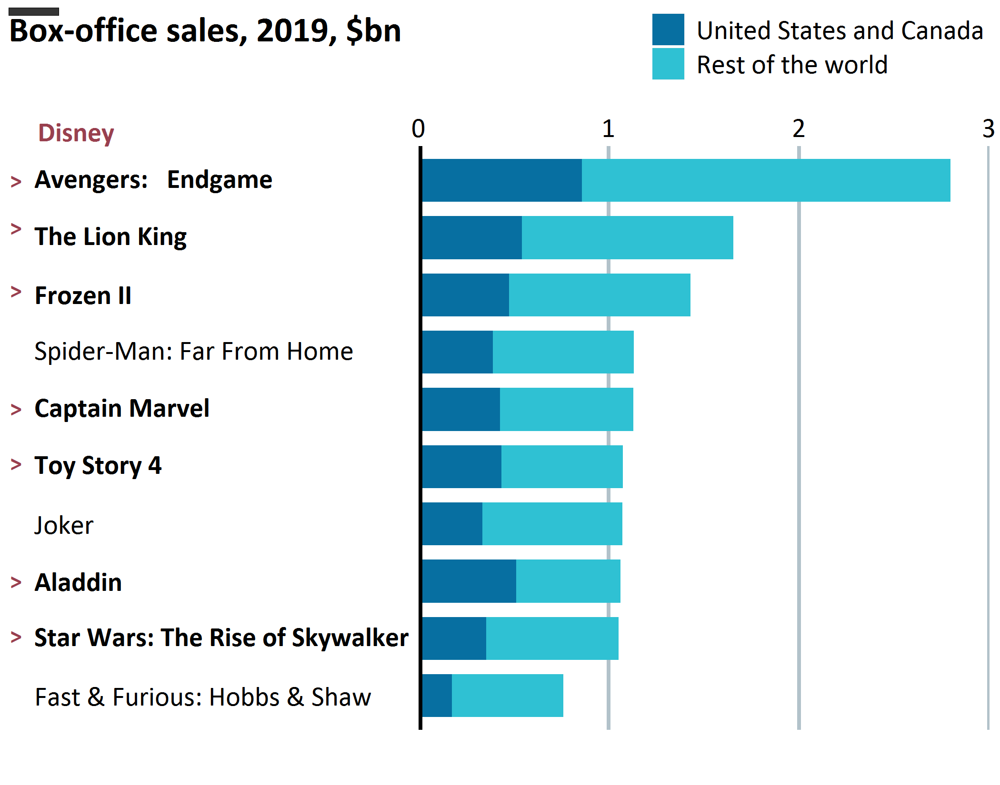
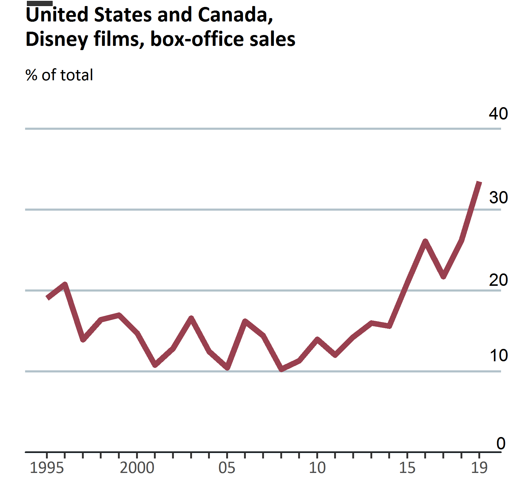
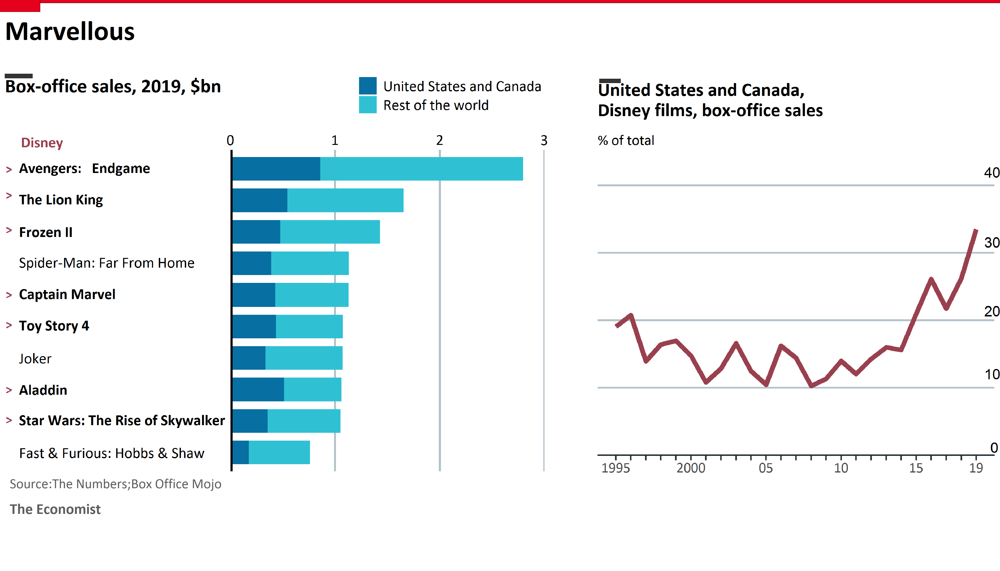

```{r setup, include=FALSE}
knitr::opts_chunk$set(echo = TRUE, warning = FALSE, message = FALSE)
options(scipen = 9999)
```

#1. Introduction
The Economist is a website's news which contains variety of information and some information is provided using a chart/plot. In this article, we will try to replicate plot from The Economist using "ggplot" library.


#2. Background 
##Article and Library{.tabset .tabset-fade .tabset-pills}
### 1.1 Disney Cart
The Disney Chart on its [article](https://www.economist.com/graphic-detail/2020/01/02/disney-reigns-supreme-over-the-film-industry) contains information about sales and market shares of Disney Box Office in United States, Canada, and around the world in the year of 2019. 

### 1.2 Libraries
```{r ,results='hide'}
library(tidyverse) #data wrangling
library(ggplot2) #data visualization
library(dplyr) #data wrangling
library(extrafont) #font library
library(gridExtra) #create grid
library(grid) #create grid
library(png) #import plot to image
font_import()
#load font from local
loadfonts(device = "win")

```

#3. First Plot (Bar Plot)
##3.1 Data Wrangling
Before we go to plot visualization, let's do prepare and clean the data:

###3.1.1 Read csv file from working directory
```{r}
box_office_sales <- read_csv("box office sales 2019.csv")
head(box_office_sales)
```
###3.1.2 Select several data
In this visualization we only use top 11 data from a whole.
```{r}
data_1_new <- data.frame(head(box_office_sales,11))
data_1_new
```

```{r echo=FALSE, results='hide'}
#check missing values
is.na(data_1_new)
```
###3.1.3 Drop Several Column
Since there's no information about "Jumanji" movie inside plot, we need to remove it.
```{r}
#check names of column
drop.cols <- c('Rank','Worldwide.Box.Office', 'Domestic.Share')
data_box_office <- data_1_new %>% select(-one_of(drop.cols)) %>% filter(Movie!='Jumanji: The Next Level')
            
```

```{r echo=FALSE,results='hide'}
#rename column using dplyr
data_box_office <- data_box_office %>% rename(movie = Movie, domestic_box_office=Domestic.Box.Office,
                                    international_box_office = International.Box.Office
                                    )
```
###3.1.4 String Manipulation
Replace special character like "$" and "," to be blank space.
```{r}
data_box_office[,c(2,3)]<- lapply(data_box_office[,c(2,3)], function(x) gsub('\\$', '', x))
data_box_office[,c(2,3)]<- lapply(data_box_office[,c(2,3)], function(x) gsub('\\,', '', x))
```

```{r echo=FALSE,results='hide'}
#convert to numeric
data_box_office[-1] <- lapply(data_box_office[-1], as.numeric)
```

```{r echo=FALSE,results='hide'}
data_plot <- data_box_office %>%
pivot_longer(-movie, names_to = "revenue_type", values_to = "value")
```
##3.2 Create Visualization
Based on visualization shown in the article, the highest sales information of disney movie put on the top of plot and followed by others in order. So we need to flip coordinate of bar plot.
```{r}
plot_bar <-
  ggplot(data = data_plot,
         aes(x = reorder(movie, value), y = value)) +
  geom_col(aes(fill = revenue_type),
           position = position_stack(reverse = TRUE),
           width = 0.75) +
  geom_hline(yintercept = 0,
             lwd = 1.75) +
  labs(
    x = "",
    y = ""
   )+
  coord_flip()

```

```{r}
plot_bar
```

We need to declare scale x labels and scale y labels, here the code below : 
```{r}
plot_bar <-
  plot_bar +
   scale_x_discrete(labels = rev(c(expression(paste(bold("Avengers:   Endgame"))),expression(paste(bold("The Lion King"))),expression(paste(bold("Frozen II"))),expression(paste("Spider-Man: Far From Home")),expression(paste(bold("Captain Marvel"))),expression(paste(bold("Toy Story 4"))),expression(paste("Joker")),expression(paste(bold("Aladdin"))),expression(paste(bold("Star Wars: The Rise of Skywalker"))),expression(paste("Fast & Furious: Hobbs & Shaw")))
                  )) +
  scale_y_continuous(limits = c(0, 3000000000),
                     labels = c("0","1","2","3"),
                     expand = c(0, 2),
                     position = "right") 
plot_bar <-
  plot_bar +
  labs(title = "Box-office sales, 2019, $bn\n",
       caption_left = " \n"
       )
plot_bar
```
Applying theme into bar plot

```{r}
plot_bar <-
  plot_bar+
  theme(

    legend.title = element_blank(),
    legend.direction = "vertical",
    legend.box = "horizontal",
    legend.position = c(0.7,1.18),
    legend.text=element_text(size=14),
    
    panel.background = element_blank(),
    panel.grid.minor = element_blank(),
    panel.grid.major.x = element_line(color = "#B2C2CA", size = 1),
    panel.grid.major.y = element_blank(),
    
    plot.title = element_text(face = "bold", size = 18, hjust = -2.32, vjust= -0.1),
   
    axis.text = element_text(color = "black"),
    axis.ticks = element_blank(),
    axis.text.y = element_text(hjust=0,size=14),
    axis.text.x = element_text(size = 14),

    
    text = element_text(family = "Calibri")
   
  )
  # Edit legend title and labels
plot_bar <- plot_bar+ 
   scale_fill_manual(values=c("#076fa1","#2fc1d3"),name = "\n", labels = c("United States and Canada", "Rest of the world"))
```
###3.2.1 Result
After all of visualization above was done, save the plot into png file. Replace the bullet symbol into arrow (>) symbol, because ggplot haven't yet accomodate to applying bullet symbol inside plot. We can applied them using grob text. And here below the result.
```{r}
png("bar.png", width = 7, height = 5.5, units = "in", res =300)
plot_bar

grid.rect(x = 0.064, y = 0.98,
          hjust = 1.1, vjust = 0,
          width = 0.05,height = 0.01,
          gp = gpar(fill="#353535",lwd=0))

grid.text("Disney",
          x=0.038, y=0.82, vjust = 0, hjust=0,
          gp=gpar(col="#99404f", fontsize=14, fontfamily="Calibri", fontface="bold"))
grid.text(">",
          x=0.01, y=0.76, vjust = 0, hjust=0,
          gp=gpar(col="#99404f", fontsize=12, fontfamily="Calibri", fontface="bold"))
grid.text(">",
          x=0.01, y=0.7, vjust = 0, hjust=0,
          gp=gpar(col="#99404f", fontsize=12, fontfamily="Calibri", fontface="bold"))
grid.text(">",
          x=0.01, y=0.62, vjust = 0, hjust=0,
          gp=gpar(col="#99404f", fontsize=12, fontfamily="Calibri", fontface="bold"))
grid.text(">",
          x=0.01, y=0.47, vjust = 0, hjust=0,
          gp=gpar(col="#99404f", fontsize=12, fontfamily="Calibri", fontface="bold"))
grid.text(">",
          x=0.01, y=0.4, vjust = 0, hjust=0,
          gp=gpar(col="#99404f", fontsize=12, fontfamily="Calibri", fontface="bold"))
grid.text(">",
          x=0.01, y=0.25, vjust = 0, hjust=0,
          gp=gpar(col="#99404f", fontsize=12, fontfamily="Calibri", fontface="bold"))
grid.text(">",
          x=0.01, y=0.18, vjust = 0, hjust=0,
          gp=gpar(col="#99404f", fontsize=12, fontfamily="Calibri", fontface="bold"))


dev.off()
```


#4. Second Plot (Line Plot)
##4.1 Data Wrangling
Before we go to plot visualization, let's do prepare and clean the data:

###4.1.1 Read csv file from working directory
```{r}
market_shares_disney <- read_csv("Disney Market Shares.csv")
head(market_shares_disney)
```

```{r echo=FALSE,results='hide'}
str(market_shares_disney)
```

```{r echo=FALSE,results='hide'}
colnames(market_shares_disney)
```
###4.1.2 Drop several column
```{r}
#drop unused column
drop.cols <- c('Movies in Release','Gross', 'Tickets Sold','Inflation-Adjusted Gross','Top-Grossing Movie','Gross that Year')
data_market_shares <- market_shares_disney %>% select(-one_of(drop.cols))

```

```{r echo=FALSE,results='hide'}

#rename column using dplyr
data_market_shares <- data_market_shares %>% rename(year = "Year", market_share = 'Market Share') %>% filter(year!='2020')
```

```{r echo=FALSE,results='hide'}
str(data_market_shares)
```

```{r echo=FALSE,results='hide'}
is.na(data_market_shares)
```
###4.1.3 String Manipulation
Replace special character "%" to be blank space.
```{r }
#remove % 
data_market_shares[2]<- lapply(data_market_shares[2], function(x) gsub('\\%','',x))
```

```{r echo=FALSE}
data_market_shares[2]<- lapply(data_market_shares[2], as.numeric)
```
##4.2 Create Visualization
```{r}
# creating plot
plot_line <- ggplot(data=data_market_shares, aes(x=year, y=market_share, group=1)) +
  geom_line(color="#99404f", size=2.2)+labs(x="",y="")
plot_line
```

We need to declare scale x labels and add some title and subtitle inside plot, here the code below : 
```{r}
plot_line <- plot_line +
  scale_y_continuous(limit = c(0,40),
                    expand = c(0,0))+
  scale_x_continuous(breaks = seq(1995,2019,by=1),
                     labels = c("1995", rep("",4), "2000", rep("",4), "05",      rep("",4),"10",rep("",4),"15",rep("",3),"19"))+
  labs(title = "United States and Canada,\nDisney films, box-office sales \n\n",
       subtitle = expression(paste("% of total \n\n")))+
  coord_cartesian(clip = "off")
plot_line
```

Customize y labels using grob text, because text lebels need to put inside plot.
```{r}
label_0<- grobTree(textGrob("0", x=0.99,y=0.03, hjust=0,
                          gp=gpar(col="black", fontsize=14)))
label_10 <- grobTree(textGrob("10", x=0.975,y=0.302, hjust=0,
                          gp=gpar(col="black", fontsize=14)))
label_20 <- grobTree(textGrob("20", x=0.975,y=0.535, hjust=0,
                          gp=gpar(col="black", fontsize=14)))
label_30 <- grobTree(textGrob("30", x=0.975,y=0.79, hjust=0,
                          gp=gpar(col="black", fontsize=14)))
label_40 <- grobTree(textGrob("40", x=0.975,y=1.049, hjust=0,
                          gp=gpar(col="black", fontsize=14)))


plot_line <- plot_line+
  annotation_custom(label_0)+
  annotation_custom(label_10)+
  annotation_custom(label_20)+
  annotation_custom(label_30)+
  annotation_custom(label_40)

plot_line
```


Adjust theme into line plot
```{r}
plot_line <- plot_line +
  theme(
    text = element_text(family = "Calibri"),
    axis.text = element_text(size = 14),
    axis.line.x = element_line(color = "black", size=0.5),
    
    panel.background = element_blank(),
    panel.grid.minor = element_blank(),
    panel.grid.major.x = element_blank(),
    panel.grid.major.y = element_line(color="#B2C2CA", size = 0.8),
    
    axis.ticks.y = element_blank(),
    axis.ticks.x = element_line(size = 0.75),
    axis.ticks.length.x = unit(5, "pt"),
    axis.text.y = element_blank(),
    
    plot.title = element_text(family="Calibri", face="bold", size=18, hjust = 0, vjust = 1),
    plot.subtitle = element_text(family = "Calibri", size = 14,hjust = 0, vjust = 1)
    
  )
plot_line
```

###4.2.1 Result
After all of visualization above was done, save the plot into png file
```{r}
png("line.png", width = 5.6, height = 5.5, units = "in", res =300)
plot_line

grid.rect(x = 0.078, y = 0.99,vjust = 0.2,
          width = 0.05,height = 0.01,
          gp = gpar(fill="#353535",lwd=0))
dev.off()
```


#5.Finishing
In this finishing step we will combine two plot into one plot. We need to add some accessories like caption and header plot.
```{r}
png("plot.png", width=14,height=8,units="in", res=300)

bar_plot <- rasterGrob(as.raster(readPNG("bar.png")),interpolate = FALSE)
line_plot <- rasterGrob(as.raster(readPNG("line.png")),interpolate = FALSE)
spacing <- rectGrob(gp=gpar(col="white"))

grid.arrange(bar_plot,spacing,line_plot, ncol=3, widths=c(0.52,0.025,0.4))

grid.rect(x=1,y=0.995,
          hjust = 1,vjust = 0.02,
          height = 0.01,
          gp= gpar(fill="#E5001c",lwd=0))
grid.rect(x=0.04,y=0.98,
          hjust = 1,vjust = 0.01,height = 0.05,
          gp= gpar(fill="#E5001c",lwd=0))
grid.text("Marvellous",
          x=0.005, y=0.93, vjust = 0, hjust=0,
          gp=gpar(col="black", fontsize=28, fontfamily="Calibri", fontface="bold"))
#caption
grid.text("Source:The Numbers;Box Office Mojo",
          x=0.01, y=0.145, vjust = 0, hjust=0,
          gp=gpar(col="#5E5E5E", fontsize=14, fontfamily="Calibri"))
grid.text("The Economist",
          x=0.01, y=0.1, vjust = 0, hjust=0,
          gp=gpar(col="#5E5E5E", fontsize=15, fontfamily="Calibri",fontface="bold"))

dev.off()
```

And.... Voilaaaaaa... finally we can create and replicate plot from The Economist using ggplot!



